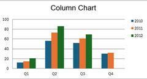
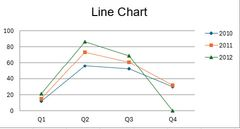
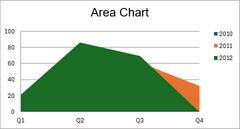

## FastExcelWriter - Charts

You can insert charts to generated spreadsheets (You can find usage examples below or in */demo* folder)

### Simple usage of chart

```php
// Create Excel workbook
$excel = Excel::create(['Chart Demo']);

$sheet = $excel->sheet();

$data = [
    ['',	2010,	2011,	2012],
    ['Q1',   12,   15,		21],
    ['Q2',   56,   73,		86],
    ['Q3',   52,   61,		69],
    ['Q4',   30,   32,		0],
];

foreach ($data as $row) {
    $sheet->writeRow($row);
}

// Define data series for chart
$dataSeries = [
    // key - cell with name of data series
    // value - range with data series
    'B1' => 'B2:B5', 
    'C1' => 'c2:c5', 
    'D1' => 'd2:d5',
];

$chartTitle = 'Bar Chart';

// Create chart
$chart = Chart::make(Chart::TYPE_COLUMN, $chartTitle, $dataSeries)
    // X axis tick values
    ->setCategoryAxisLabels('A2:A5')
    // Position of legend
    ->setLegendPosition(Legend::POSITION_TOPRIGHT)
;

//	Add the chart to the worksheet
$sheet->addChart('A7:H20', $chart);

// Save to XLSX-file
$excel->save($outFileName);

```

### Advanced Example

When you use a simple address ```D8```, it is always converted to the absolute address of the sheet 
where the chart is inserted: ```Worksheet!$D$8```
```php
$sheet = $excel->getSheet('Jan');
$chart = Chart::make(Chart::TYPE_COLUMN, $chartTitle, ['A1' => 'A2:A5']);

// This code will give the same result
$chart = Chart::make(Chart::TYPE_COLUMN, $chartTitle, ['Jan!$A$1' => 'Jan!$A$2:$A$5']);
```
Cell values or strings can be used as labels
But you can use full addresses to add data from another sheet to the chart. 
```php
$chart = Chart::make(Chart::TYPE_COLUMN)
    ->addDataSeriesSet(['Jan!$A$1' => 'Jan!$A$2:$A$5', 'Feb!$A$1' => 'Feb!$A$2:$A$5'])
    ->addDataSeriesValues('B2:B5', 'B1')
    ->addDataSeriesValues('C2:B5', 'Demo1');
;
```
You can set options for data series
```php
$options = [
    'color' => '#ff0000', // used for any chart types 
    'width' => '10', // used for lines charts only 
    'marker' => true, // used for lines charts only
    'segment_colors' => '#ff0000,cbcb00,0c0' // used for pie and pie3D
];

$chart = Chart::make(Chart::TYPE_LINE)
    ->addDataSeriesValues($dataSource, $labelSourse, $options);
```    
Available colors format:
* 6 hex chars with '#' - #ffcc00
* 6 hex chars without '#' - ffcc00
* 3 hex chars without '#' - #fc0
* 3 hex chars without '#' - fc0


### Multiple charts

```php
// Make chart 1
$chart1 = Chart::make(Chart::TYPE_COLUMN, 'Column Chart', ['b1' => 'B2:B5', 'c1' => 'c2:c5', 'd1' => 'd2:d5'])
    ->setCategoryAxisLabels('A2:A5')
    ->setLegendPosition(Legend::POSITION_TOPRIGHT)
;

//	Add the chart to the worksheet
$sheet->addChart('a9:h22', $chart1);

// Make chart 2
$chart2 = Chart::make(Chart::TYPE_PIE, 'Pie Chart', ['b6:d6'])
    ->setCategoryAxisLabels('b1:d1')
    ->setLegendPosition(Legend::POSITION_TOPRIGHT)
    ->setPlotShowPercent(true)
;

//	Add the chart to the worksheet
$sheet->addChart('i9:m22', $chart2);
```

### Combo charts

You can combine two types of charts on one plot - column charts and line charts

```php
// Create combo chart
$chart = Chart::make(Chart::TYPE_COMBO, 'Combo Chart', )
    // add column data series:
    // addDataSeriesType(\<type>, \<data source>, <label source>) 
    ->addDataSeriesType(Chart::TYPE_COLUMN, 'B2:B5', 'B1')
    // add another column data series
    ->addDataSeriesType(Chart::TYPE_COLUMN, 'C2:C5', 'C1')
    // add another line data series
    ->addDataSeriesType(Chart::TYPE_LINE, 'D2:D5', 'D1')
    // source of category (horizontal) axis labels
    ->setCategoryAxisLabels('A2:A5')
    // position of legend
    ->setLegendPosition(Legend::POSITION_TOPRIGHT)
;

//	Add the chart to the worksheet
$sheet->addChart('a9:h22', $chart);
```
Result of this code:


### Chart types

| const name of class<br/>Chart       | chart type            |                                                                         |
|-------------------------------------|-----------------------|-------------------------------------------------------------------------|
| TYPE_BAR                            | bar chart             |                          |
| TYPE_BAR_STACKED                    | stacked bar chart     |                          |
| TYPE_COLUMN                         | column chart          |                    |
| TYPE_COLUMN_STACKED                 | stacked column chart  |    |
| TYPE_LINE                           | line chart            |                        |
| TYPE_LINE_STACKED                   | stacked line chart    |        |
| TYPE_LINE_3D                        | line 3D chart         |                  |
| TYPE_LINE_3D_STACKED                | stacked line 3D chart |  |
| TYPE_AREA                           | area chart            |                        |
| TYPE_AREA_STACKED                   | stacked area chart    |        |
| TYPE_AREA_3D                        | area 3D chart         |                  |
| TYPE_AREA_3D_STACKED                | stacked area 3D chart |        |
| TYPE_PIE                            | pie chart             |                          |
| TYPE_PIE_3D                         | pie 3D chart          |                    |
| TYPE_DONUT                          | doughnut chart        |                      |

### Useful Chart Methods 

* setTitle(\<string>) - chart title
* setChartColors(\<array>) - chart colors
* setCategoryAxisLabels(\<range>) - category axis tick values
* setCategoryAxisTitle(\<string>) - category axis title
* setValueAxisTitle(\<string>) - value axis title
* setLegendPosition(\<position>) - position of legend (use constants Legend::POSITION_XXX)
* setPlotShowValues(true) - show values on the chart
* setPlotShowPercent(true) - show values is percents (for pie and sonut)
